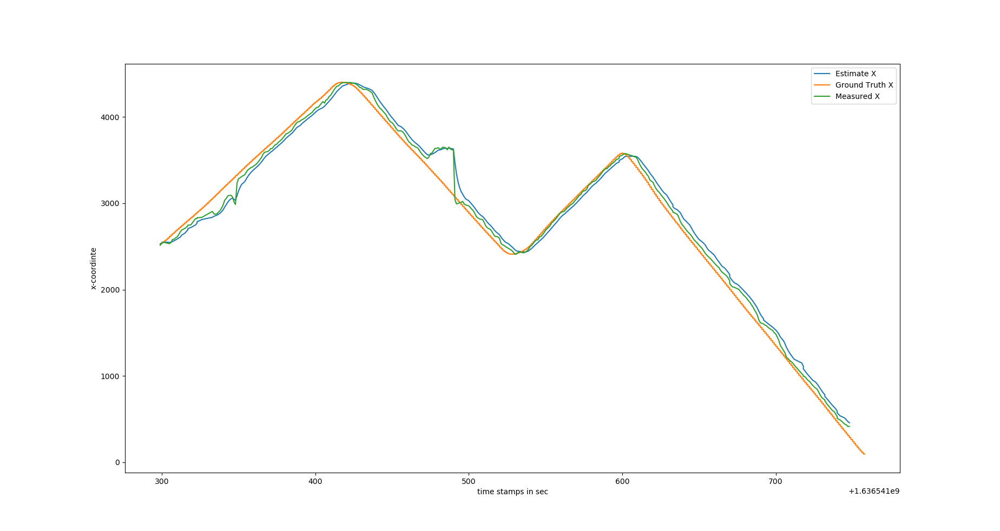
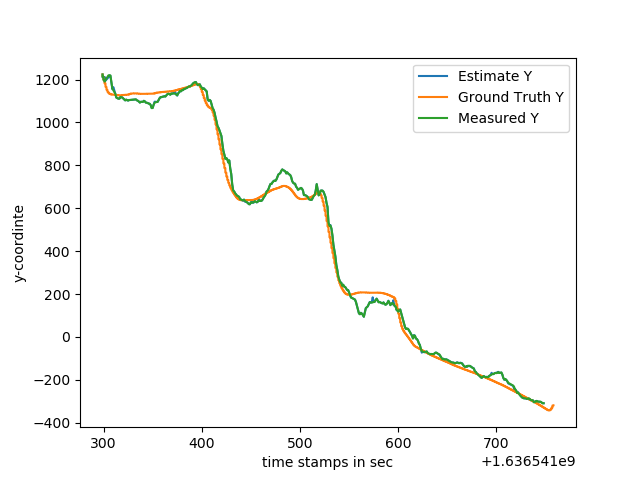
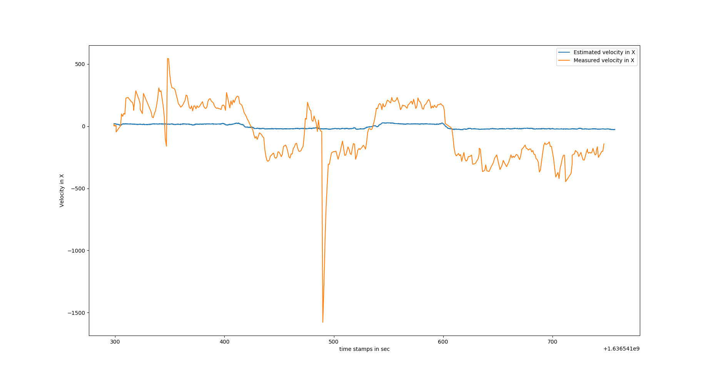
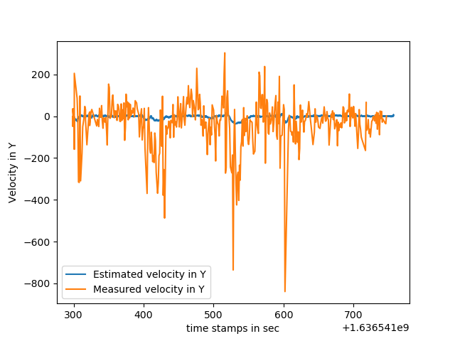

# Position Estimation
## File structure :
### main.py - soure code for Extended Kalman Filter 
### 1.png - X-Position comparison between estimate, ground truth and measured values
### 2.png - Y-Position comparison between estimate, ground truth and measured values

### 3.png - Velocity along X-axis comparison between estimate and measured values
### 4.png - Velocity along Y-axis comparison between estimate and measured values

## Filter : 
Positions are estimated and Velocities are calculated from estimated positions or the systm would become really complicated and also required information may not be available (accelerations).

Discetised form :

x(k+1) = G(x(k),u(k)) + gaussian noise

y(k+1) = H(x(k)) +  gaussian noise

Linearized form :  

  x(k+1) = phi x(k) + gamma_u u(k) + gaussian noise
  
  y(k+1) = cmat x(k) + gussian noise
## A
Conventional Kalaman filter assumes linearity at certain point for a non-linear system and then gives out the estimates, but as the robot would, it would go far away from the linearization point and would fails. This filter can be successful be the robot is assumed to move nearby, or modified to not move far away from certain point.
## B
Lidar, Sonar, Infrared Sensor can be used.
## C
EKF was implemented and resulting plots are shown below :

Comparison between estimate, ground truth and measured x-coordinate

Comparison between estimate, ground truth and measured y-coordinate

Comparison between estimate and measured velocity along x-axis

Comparison between estimate and measured velocity along y-axis
## D
The position estimates are fair enough, but the velocity estimates are far off, can be calculated using more sophisticated method for differentiation.

The EKF may fail or may be ineffecient when large time horizons are considered. Better methods can be used, like Moving Horizon estimator.